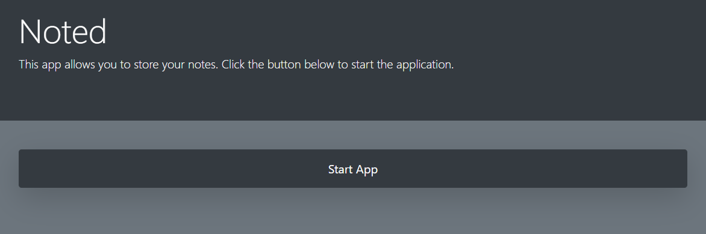
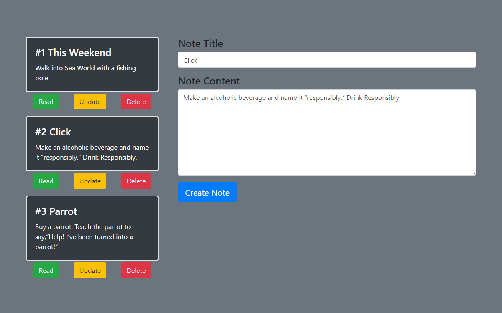

# Noted

The goal was to create an app to create, read, delete, update and store notes using Javascript, Node.js and MySQL.

## App hosted on Heroku 

  https://mp-noted.herokuapp.com/

## Getting Started

- Clone repo.
- Run command in Terminal or Gitbash 'npm install'
- Run command in Terminal or Gitbash 'npm mysql express'
- Create the database in mysql workbench.
- In db/connection.js change passowrd and port.
- Run command in Terminal or Gitbash 'node server.js'
- The app is now ready to use in browser at localhost:3000

### How to use the app

1. The home page (https://mp-noted.herokuapp.com/)
    Click the Start App button.
     

2. The notes page (https://mp-noted.herokuapp.com/notes)
     

    * Read
      To read a note, click the Read button below the note, the title and the content of the note will be displayed in the Note Title and Note Content box.
    * Update
      To update a note, first click on Read button, then change the title and the content of the note to your preference and then click on the Update button below and the note will be updated. 
    * Delete
      To delete a note, click on the delete button below the note and the note will be deleted.
    * Create 
      To create a note, click on the Create Note button after entering the desired note title and note content.
      
## Technologies used
- Node.js
- MYSQL NPM Package (https://www.npmjs.com/package/mysql)
- Express NPM Package (https://www.npmjs.com/package/express)

## Built With
* VS Code - Text Editor
* MySQLWorkbench
* Terminal/Gitbash
* Heroku - Hosting

## Authors
* **Manav Patel**
